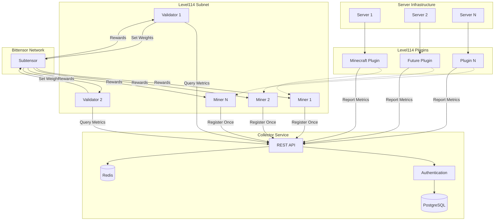
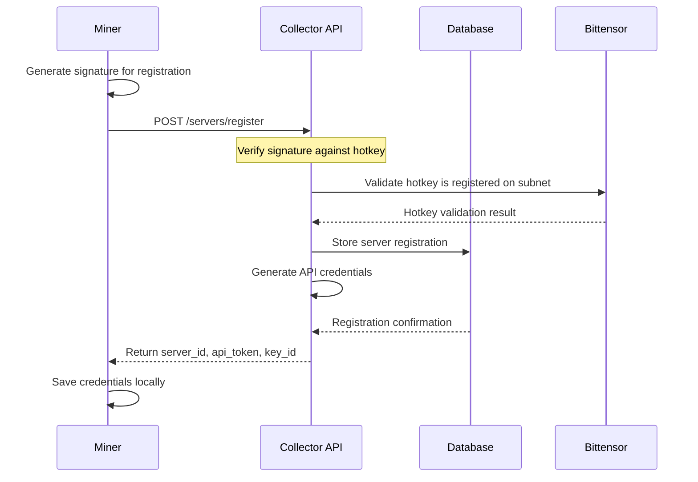
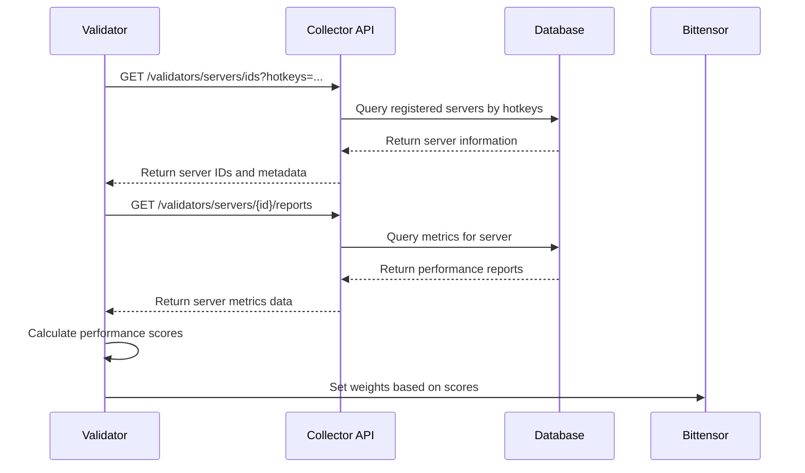

# System Architecture Overview:~$

## Components Overview

The Level114 subnet consists of four main components working together to create a decentralized infrastructure validation network.

### Level114 Collector Service
**A Rust-based central registry operated by the Level114 team**

The collector service is maintained and operated by Level114 as the central hub for server registration and metrics collection. It provides authenticated API access for validators to query server performance data.

**Key Responsibilities:**
- Accept and verify server registrations using cryptographic signatures
- Issue API credentials for authenticated operations
- Collect and store performance metrics from registered servers
- Provide query API for validators to access server data
- Maintain data integrity through cryptographic verification

**Technical Stack:**
- **Language**: Rust with Axum web framework
- **Database**: PostgreSQL for persistent storage
- **Cache**: Redis for performance optimization
- **Authentication**: Ed25519 keypairs + Bearer token API keys
- **Deployment**: Docker containers with health monitoring

### Subnet Miners
**Python processes that register server infrastructure**

Miners represent server operators who want to participate in the validation network. They register once with the collector service and can subsequently report performance metrics.

**Core Responsibilities:**
- Register server with collector service using Substrate signatures
- Save issued credentials (Server ID, API token, Key ID) locally
- Provide infrastructure for metric reporting (optional)
- Maintain server availability for validation assessment

**Registration Process:**
1. Generate registration signature using Bittensor wallet
2. Submit registration request to collector service
3. Receive and store issued credentials
4. Exit successfully after one-time registration

### Subnet Validators
**Python processes that validate server performance**

Validators continuously monitor registered servers by querying the collector service for performance metrics and setting weights on the Bittensor network accordingly.

**Core Responsibilities:**
- Query collector service for registered server information
- Retrieve performance metrics and reports for evaluation
- Assess server quality using multiple performance criteria
- Set weights on Bittensor network based on performance scores
- Maintain network quality standards through continuous monitoring

### Level114 Plugins
**Server monitoring agents that collect performance metrics**

Level114 plugins are server-specific monitoring tools that run on miners' infrastructure to collect detailed performance data and report it to the collector service.

**Available Plugins:**
- **Minecraft Plugin**: Comprehensive monitoring for Bukkit/Paper Minecraft servers
- **Monetization Plugins**: Unified shop systems, player progression, and revenue analytics for Level114 published games

**Core Responsibilities:**
- Collect real-time server performance metrics (players, resources, uptime)
- Format data into standardized reports with cryptographic integrity
- Transmit metrics securely to Level114 collector service
- Provide administrative tools for monitoring and status checking
- Enable automated revenue generation based on server quality

---

## Data Flow Architecture

---

## Registration Flow

### 1. Server Registration

### 2. Metrics Querying

---

## API Architecture

### Collector Service Endpoints

#### Public Endpoints
- `GET /health` - Service health check
- `POST /servers/register` - Server registration (rate limited)
- `GET /servers` - List registered servers (rate limited)

#### Server Endpoints (API Key Required)
- `GET /servers/{id}` - Get server details
- `GET /reports/nonce` - Get reporting nonce  
- `POST /reports/create` - Submit performance report

#### Validator Endpoints (Validator API Key Required)
- `GET /validators/servers/ids` - Get server IDs by hotkeys
- `GET /validators/servers/{id}/reports` - Get server performance reports

### Authentication Layers

1. **Public Access**: Rate limited by IP address
2. **Server API Keys**: Generated during registration, scoped to server operations
3. **Validator API Keys**: Manually issued, scoped to validation queries
4. **Signature Verification**: Substrate-compatible signatures for registration

---

## Database Schema

### Core Tables

**servers**: Registered server information
- `id`, `ip`, `port`, `hotkey`, `signature`, `status`, `last_seen`

**server_keypairs**: Cryptographic keys for servers
- `server_id`, `public_key`, `private_key`, `key_id`

**server_api_keys**: API authentication tokens
- `server_id`, `key_id`, `secret_hash`, `status`

**reports**: Performance metrics submissions
- `server_id`, `counter`, `payload`, `signature`, `created_at`

**validator_api_keys**: Validator authentication
- `hotkey`, `key_id`, `secret_hash`, `scopes`

---

## Security Model

### Registration Security
- **Signature Verification**: All registrations require valid Substrate signatures
- **Hotkey Validation**: Hotkeys must be registered on Bittensor subnet
- **Rate Limiting**: IP-based limits prevent spam registrations
- **Unique Constraints**: Prevents duplicate server registrations

### API Security  
- **Bearer Token Authentication**: API keys required for sensitive operations
- **Scoped Access**: Different key types have different permission levels
- **Request Signing**: Critical operations require cryptographic signatures
- **Cache Security**: Sensitive data cached with appropriate TTL

### Network Security
- **TLS Encryption**: All API communication encrypted in transit
- **Input Validation**: Comprehensive request validation and sanitization
- **SQL Injection Prevention**: Parameterized queries throughout
- **DoS Protection**: Rate limiting and timeout mechanisms

---

## Scalability Considerations

### Performance Optimizations
- **Redis Caching**: Frequently accessed data cached for fast retrieval
- **Database Indexing**: Optimized queries for common access patterns  
- **Connection Pooling**: Efficient database connection management
- **Async Processing**: Non-blocking I/O for concurrent request handling

### Horizontal Scaling
- **Stateless Design**: Service can be horizontally scaled behind load balancer
- **Database Sharding**: Preparation for multi-region deployments
- **Cache Distribution**: Redis clustering for high availability
- **Regional Deployment**: Geographic distribution for global access

---

**The Level114 architecture prioritizes simplicity, security, and scalability to create a robust foundation for decentralized infrastructure validation.**